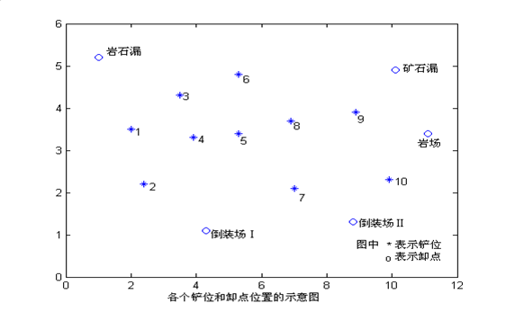
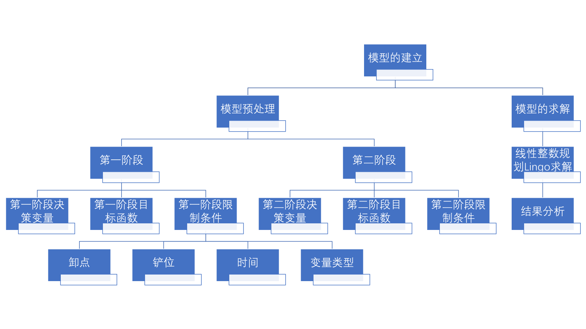

# 基于线性整数规划方法的矿生产车辆安排模型

## 摘要

在钢铁工业生产中，合理规划以提高大型设备（电铲、卡车）的利用率是增加经济收益的首要任务。本文建立了基于线性规划方法的矿生产车辆安排模型，采用逐步迭代决策变量、目标函数和约束条件，以及建立两阶段线性规划方法模型，求解与总运量和出动卡车有关的最小运输成本。

针对问题一，建立能够描述问题的两阶段线性规划数学模型，以题设条件为第一阶段条件，以第一阶段解为第二阶段条件对该问题进行优化求解。首先挖掘题设条件，将题设中的接收矿石的目的地对于矿石的质量要求、所有目的地对矿石、岩石的产量要求、产地产出矿石岩石的数量、电铲放置数量等题目信息刻画为约束条件，再把第一阶段决策变量定为总运量（吨公里）最小，表示出以总运量（吨公里）为因变量的目标函数。最后通过线性整数规划方法求解模型的目标函数。最优总运量（吨公里）为$85628.62$吨公里，出动的最少卡车数为$19$辆。

**关键词：露天矿生产、建模、分层优化法、非线性整数规划的线性化**

## 1 问题重述

### 1.1 问题背景

在露天矿生产的车辆安排问题中，需要对现有的车辆进行路线的安排和数量规划，使得在一个班次即8小时内满足每个卸点的要求，同时使吨公里数最小，出动卡车最少，以使运输成本最小。

运输过程中，需要考虑每个铲位和卸车点只能同时服务一辆车导致的铲位和卸点对车辆排班的约束。同时铲位和卸点还存在种类和品位的问题，卸点分为岩石卸点和矿石卸点，而矿石卸点的品位应处于$[0.285,0.305]$，所以还需要考虑如何将不同铲位的矿石按比例运输混合使得品位达到要求。因此我们需要在品位，铲位和卸点以及时间的约束下寻找问题的最优解。



### 1.2 问题概述

围绕相关约束和条件要求，研究露天矿产生产的车辆安排问题，我们依次提出以下问题: 

问题一：寻找每条路线的最优运输次数及其最优铲车配置点，使得吨公里数最小的同时满足每个卸点的吨位和矿石卸点的品位要求。

问题二：根据问题一得到每条路线的解进行车辆排班，得到不仅使得铲位和卸点不会出现排队现象，同时在一个班次内也能完成所有任务的最小车辆数。

## 2 模型假设

第一，每次卡车必须满载运输，这是题目要求的。

第二，一个卸点最终获得矿石的品位是所有运到该卸点的矿石的品位的平均品位。因为如果只选择最高品位来刻画该卸点矿石的品位，那么只有极少铲位提供的矿石（1、3铲位）提供的矿石符合品位要求，造成所有矿石卸点都只能去这些卸点获取矿石，计划将极其有限。

第三，运到卸点的矿石、岩石可以多于卸点要求，但不能少于。

第四，电铲不能移动，一个班次内一个电铲最多服务于一个铲位，这是因为铲位与铲位之间的距离不明，并且不考虑排时计划。如果明确铲位之间距离，可以进一步细化移动电铲以及其消耗的时间。

第五，一辆卡车在一个班次内只能服务于一条路线，这是因为路线与路线之间的距离不明确，所以无法安排一辆卡车到另一条路线上。这个限制也许会极大提升卡车用量。

第六，假设路上不堵车，这是题目给出的。卡车在卸点和铲位堵不堵车仍需手动刻画。

第七，假设装卸时间与运输时间不精确，这是题目要求的。为保证刻画完整，下面仍会给出考虑到排时计划的一些公式，在最终结果中剔除。

## 3 问题一模型的建立与求解

### 3.1 问题分析与描述

问题一要求考虑总运量（吨公里）和出动卡车最少，分别给出一个班次内的限制条件。由于总运量和出动卡车数都可以用变量刻画，并且限制条件也能用公式刻画，在全部数学化这些变量和公式之后，即可使用线性/非线性规划模型求解问题。



### 3.2 基于线性整数规划的矿生产车辆安排模型的建立

#### 3.2.1 模型预处理

首先考虑问题，总运量（吨公里）不容易被直接刻画。但是如果把总运量（吨公里）考虑成所有路线的车次数，再由于路程和运载量恒定，就可以直接由车次数刻画总运量。而车次数比较容易被下面提出的限制条件刻画，故选择车次数作为决策变量。

题目对优化提出两个要求，第一是总运量（吨公里）最小，第二是出动最少的卡车。语义上，这属于多目标优化问题，有两到三种方法可以选择。

第一种是加权求和法，它要求对两种目标即总运量和卡车设定权重，然后相加求最小值[1]。这种方法具有主观性，同时题目未给出权重偏向的条件，故不予考虑。

第二种方法是目标规划法。它要求决策者先为每个目标设定一个明确的期望值。然后，该方法将各个目标的实际完成值与期望值之间的偏差作为新的优化对象。通过为不同目标的偏差设定优先级，模型会优先满足高优先级的目标，再尽可能满足低优先级的目标，从而在复杂的多目标冲突中，找到一个最符合决策者主观偏好的妥协解[2]。它依赖于目前存在可行解、目标可量化、偏好可排序的基础。但由于该模型过于复杂，直接给出可行解是不可能的，同时题目要求硬性对总运量（吨公里）和卡车数求最低，不符合目标规划法有可能不满足某个条件的结果，故不予考虑。

第三种方法是分层优化法。它的核心是把第一个最优解作为第二个最优解的条件[3]。注意到题目中明确提出“只求出各条路线上的卡车数及安排即可”，即最终目标是卡车数，那么可以将总运量（吨公里）最小作为安排卡车的条件。下面采取分层优化法求解该问题。

#### 3.2.2 第一阶段决策变量

题目要求最小化的变量：总运量（吨公里），由吨数和公里数组成。吨数固定为154吨每车每回；公里数由每条路线上的卡车数，和该路线连接的卸点和铲位的距离构成。同时由于只有7台铲车，最多选择7个卸点运作，可以用布尔变量表示某卸点运作。则决策变量可以表示为：

$n_{ij}$：从铲位j到卸点i的车次数

$z_{j}$：铲位j是否被使用

#### 3.2.3 第一阶段目标函数

题目要求总运量（吨公里）数最小，即一个班次内的总运量（吨公里）数最小，根据上面提出的决策变量，吨公里数可以表示为

$\min \quad 154\sum_{i=1}^{5}(\sum_{j=1}^{10}n_{ij}d_{ij}z_{j})$

其中，

系数$154$是每车容量（单位：吨）；

$d_{ij}$是从铲位j到卸点i的距离（单位：公里）；

#### 3.2.4 第一阶段约束条件

问题中，由于总运量（吨公里）的数值与铲位j到卸点i的车次数密切相关，而车次数由班次时间、卸点要求、铲位限制密切相关，需要对这些限制条件分大类，并列出所有限制条件，综合并多维度地考虑所有限制条件的关系，对决策变量$n_{ij}$的影响和刻画。这些限制条件可以分为四大类，分别是：卸点约束、铲位约束、时间约束、变量类型约束。

提取题目信息，可以得到多个约束条件。具体来说，约束可以分为以下几个约束：矿石卸点对矿石的品位要求；所有卸点对矿石、岩石的产量要求；各铲位可提供的矿石、岩石的数量限制；电铲数量限制；每个铲位$j$的总装车车次在一个班次时间内的限制；每个卸点$i$的总卸车车次在一个班次时间内的限制；所有路线的总工作时间相对于卡车总工作时间的限制，以及变量类型限制（车次数$n_{ij}$必须是整数，$z_{ij}$的值域为$0$，$1$）。

##### 3.2.4.1 卸点约束

###### 3.2.4.1.1 矿石卸点对矿石品位的要求

对于每个矿石卸点$i$，一个班次内的平均品位必须在$[0.285,0.305]$范围内，如果设铲位$j$提供的矿石品位为$y_{j}$，则一个班次内的品位要求可以表示为

$\frac{\sum_{j=1}^{10} n_{ij}  y_j}{\sum_{j=1}^{10} n_{ij}} \geq 0.285$

$\frac{\sum_{j=1}^{10} n_{ij}  y_j}{\sum_{j=1}^{10} n_{ij}} \leq 0.305$

###### 3.2.4.1.2 所有卸点对矿石或岩石的产量要求

对于每个卸点$i$，一个班次内的产量必须满足要求，可以多余，不能少于。设$Q_{i}$为卸点$i$的产量要求，则每个卸点在一个班次内的产量要求可以表示为

$154 \sum_{j=1}^{10} n_{ij} \geq Q_i, \quad i=1,2,3,4,5$

##### 3.2.4.2 铲位约束

###### 3.2.4.2.1 所有铲位供应矿石的限制

所有铲位一个班次内向外供应的总矿石，不能超过该铲位一个班次内出产（供应）矿石的总量。设$S_j^{\text{ore}}$为铲位$j$在一个班次内矿石的最大供应量，则该限制可以表示为

$154 \sum_{i=1}^{3} n_{ij} \leq S_j^{\text{ore}}, \quad j=1,\dots,10$

###### 3.2.4.2.2 所有铲位供应岩石的限制

同上，所有铲位一个班次内向外供应的总岩石，不能超过该铲位一个班次内出产岩石的总量。设$S_j^{\text{rock}}$为铲位$j$在一个班次内矿石的最大供应量，则该限制可以表示为

$154 \sum_{i=4}^{5} n_{ij} \leq S_j^{\text{rock}}, \quad j=1,\dots,10$

###### 3.2.4.2.3 电铲放置约束

现有七台电铲可以放置在铲位，所以一个班次内启用的铲位不能超过七个。该限制可以表示为：

$\sum_{j=1}^{10} z_j \leq 7$

##### 3.2.4.3 时间约束

###### 3.2.4.3.1 电铲装车能力约束

一个班次为$8$小时$480$分钟，电铲装车的时间为$5$分钟，则电铲总装车时间不能超过$480$分钟。由于一个铲位$j$上的电铲需要同时服务所有卸点来的卡车，假设卡车一开始从卸点出发开往铲位，则电铲从$0$时刻迎接第一辆卡车的最早时间为

$\frac{60d_{\min,j}}{28}$

其中：

$d_{\min,j} = d_{i_{\min}j}$ 是铲位$j$到所有卸点的最小距离；

分母$28$为卡车时速；

系数$60$表示$1$小时等于$60$分钟。

则电铲在一个班次内可运作的时间可以表示为

$480 - \frac{60d_{\min,j}}{28}$

电铲可装车的次数可以表示为

$\left\lfloor \frac{480 - \frac{60d_{\min,j}}{28}}{5} \right\rfloor$

因为电铲装车次数必须是整数，而多余未成整数的部分不能充当一次装车，所以这里必须向下取整。

则有限制条件

$\sum_{i=1}^{5} n_{ij} \leq \left\lfloor \frac{480 - \frac{60d_{\min,j}}{28}}{5} \right\rfloor z_j, \quad j=1,\dots,10$

假设一开始卡车从铲位出发开往卸点，则有限制条件

$\sum_{i=1}^{5} n_{ij} \leq \left\lfloor \frac{480}{5} \right\rfloor z_j, \quad j=1,\dots,10$

考虑到题目明确说明：因为随机因素影响，装卸时间与运输时间都不精确，所以排时计划无效，并且“电铲从$0$时刻迎接第一辆卡车的最早时间”明确属于排时计划范畴，所以这个条件可以去掉，则有限制条件

$\sum_{i=1}^{5} n_{ij} \leq \left\lfloor \frac{480}{5} \right\rfloor z_j, \quad j=1,\dots,10$

###### 3.2.4.3.2 卸点服务时间约束

同上，一个班次为$8$小时$480$分钟，电铲装车的时间为$5$分钟，则电铲总装车时间不能超过$480$分钟。由于一个卸点$i$需要同时服务所有铲位来的卡车，假设卡车一开始从卸点出发开往铲位，则卸点从$0$时刻迎接第一辆卡车的最早时间为

$2\frac{60d_{i,\min}}{28} + 5$

其中：

$d_{i,\min} = d_{ij_{\min}}$ 是卸点$i$到所有铲位的最小距离；

系数$2$表示需要经过两次路线，一次来回；

常数$5$表示卡车在卸点装上矿石的时间为$5$分钟。

则卸点在一个班次内可运作的时间可以表示为

$480 - (2\frac{60d_{\min,i}}{28} + 5)$

卸点可接收卸货的次数可以表示为

$\left\lfloor \frac{480 - \left(2\frac{60d_{i,\min}}{28} + 5\right)}{3} \right\rfloor$

则有限制条件

$\sum_{j=1}^{10} n_{ij} \leq \left\lfloor \frac{480 - \left(2\frac{60d_{i,\min}}{28} + 5\right)}{3} \right\rfloor, \quad i=1,2,3,4,5$

假设一开始卡车从铲位出发开往卸点，则有限制条件

$\sum_{j=1}^{10} n_{ij} \leq \left\lfloor \frac{480 - \left(\frac{60d_{i,\min}}{28} + 5\right)}{3} \right\rfloor, \quad i=1,2,3,4,5$

考虑到题目明确说明：因为随机因素影响，装卸时间与运输时间都不精确，所以排时计划无效，并且“卸点从$0$时刻迎接第一辆卡车的最早时间”明确属于排时计划范畴，所以这个条件可以去掉，则有限制条件

$\sum_{j=1}^{10} n_{ij} \leq \left\lfloor \frac{480}{3} \right\rfloor, \quad i=1,2,3,4,5$

###### 3.2.4.3.3 卡车数量约束

所有路线的总工作时间不能超过所有卡车可用的总时间，由于有$20$辆卡车，则所有卡车可用的总时间为$9600$分钟。一辆卡车运输一轮，在铲位和卸点装载的时间为$5+3=8$分钟，则所有卡车在铲位和卸点消耗的总时间可以表示为

$8\sum_{i=1}^{5}(\sum_{j=1}^{10} n_{ij})$

一辆卡车运输一轮，在卸点i和铲位j的路上消耗的时间可以表示为$2(60d_{ij}/28)$分钟，该路线上的所有卡车消耗的总时间可以表示为$2(60n_{ij}d_{ij}/28)$，则所有路线上所有卡车消耗的总时间可以表示为

$2(60/28)\sum_{i=1}^{5}(\sum_{j=1}^{10} n_{ij} d_{ij})$

所有路线总工作时间不可超过所有卡车可用总时间的限制，可以表示为

$8 \sum_{i=1}^{5}(\sum_{j=1}^{10} n_{ij})+ 2(60/28) \sum_{i=1}^{5}(\sum_{j=1}^{10} n_{ij} d_{ij})\leq 9600$

##### 3.2.4.4 变量类型约束

车次数$n_{ij}$必须为整数，刻画铲位是否被启用的布尔变量$z_{j}$值域必须为$0$和$1$：

$n_{ij} \in \mathbb{Z}^+, \quad z_j \in \{0,1\}$

#### 3.2.5 目标函数优化

考虑到目标函数$\min \quad 154\sum_{i=1}^{5}(\sum_{j=1}^{10}n_{ij}2d_{ij}z_{j})$内含两个未知变量$n_{ij}$和$z_{j}$相乘，Lingo会把该问题考虑成非线性整数规划（PIQP，Pure Integer Quadratic Programming）问题。对于非线性整数规划问题，Lingo的输出永远为Local Opt（局部最优解），这不符合我们对总运量（吨次数）全局最优的要求。

重新查看电铲装车能力约束，我们已经在该约束里面对电铲提供的装车次数乘以$z_{j}$，$z_{j}$为$0$的铲位不会提供装车次数，这实际上已经确保了$n_{ij}$在对应的$j$下被约束为0。所以，我们不需要再在目标函数里乘以$z_{j}$。现在，修改目标函数为

$\min \quad 154\sum_{i=1}^{5}(\sum_{j=1}^{10}n_{ij}2d_{ij})$

对于线性整数规划问题，Lingo可以输出Global Opt（全局最优解），符合我们对总运量（吨次数）全局最优的要求。不过这样仍不能确保Lingo把该模型看作线性整数规划（Pure Integer Linear Programming）问题，下面会继续给出优化方法。

#### 3.2.6 约束条件优化

考虑到约束条件$\frac{\sum_{j=1}^{10} n_{ij}  y_j}{\sum_{j=1}^{10} n_{ij}} \geq 0.285$、$\frac{\sum_{j=1}^{10} n_{ij}  y_j}{\sum_{j=1}^{10} n_{ij}} \leq 0.305$的分子和分母都有决策变量$n_{ij}$，不符合线性整数规划的情况，Lingo会将模型识别成整数非线性规划，并且由于非线性的特点而闪退或报错不能求解。即使能输出结果，也会输出Local Opt将这两个约束条件线性化，把分母乘到右边并移项有

$\sum_{j=1}^{10} n_{ij}  y_j-0.285\sum_{j=1}^{10} n_{ij} \geq 0$

$\sum_{j=1}^{10} n_{ij}  y_j-0.305\sum_{j=1}^{10} n_{ij} \leq 0$

这样可以防止非线性整数规划的情况出现。修改这个约束条件之后，模型变为线性整数规划问题，Lingo可以输出全局最优解，并且求解速度提升。

#### 3.2.7 基于线性整数规划方法的矿生产车辆安排，第一阶段模型

排时计划无效化：

```math
\min \quad 154\sum_{i=1}^{5}(\sum_{j=1}^{10}n_{ij}d_{ij})
```

```math

\text{s.t.} \quad

\left
\{

\begin{aligned}

& \sum_{j=1}^{10} n_{ij}  y_j-0.285\sum_{j=1}^{10} n_{ij} \geq 0, \quad i=1,2,3 \\

& \sum_{j=1}^{10} n_{ij}  y_j-0.305\sum_{j=1}^{10} n_{ij} \leq 0, \quad i=1,2,3 \\

& 154 \sum_{j=1}^{10} n_{ij} \geq Q_i, \quad i=1,2,3,4,5 \\

& 154 \sum_{i=1}^{3} n_{ij} \leq S_j^{\text{ore}}, \quad j=1,\dots,10 \\

& 154 \sum_{i=4}^{5} n_{ij} \leq S_j^{\text{rock}}, \quad j=1,\dots,10 \\

& \sum_{j=1}^{10} z_j \leq 7 \\

& \sum_{i=1}^{5} n_{ij} \leq \left\lfloor \frac{480}{5} \right\rfloor z_j, \quad j=1,\dots,10 \\

& \sum_{j=1}^{10} n_{ij} \leq \left\lfloor \frac{480}{3} \right\rfloor, \quad i=1,2,3,4,5 \\

& 8 \sum_{i=1}^{5}(\sum_{j=1}^{10} n_{ij})+ 2(60/28) \sum_{i=1}^{5}(\sum_{j=1}^{10} n_{ij} d_{ij})\leq 9600 \\

& n_{ij} \in \mathbb{Z}^+ \\

& z_j \in \{0,1\} \\

\end{aligned}

\right.

```

#### 3.2.8 第二阶段决策变量

题目要求最小化的变量：最少出动卡车数。基于第一阶段求出的从卸点$i$到铲位$j$来回的次数，可以直观分配所需卡车，直至满足这条路线上的要求即可。为保证过程的严谨性，给出决策变量：

$N_{ij}$：分配到从铲位 $j$ 到卸点 $i$ 的路线上的卡车数量

#### 3.2.9 第二阶段目标函数

题目的题干提出求出各条路线上的卡车数及安排，则在一个班次内，出动的卡车数最少。根据上面提出的决策变量，出动的卡车数可表示为

$\min \quad \sum_{i=1}^{5}(\sum_{j=1}^{10} N_{ij})$

#### 3.2.10 第二阶段限制条件

##### 3.2.10.1 任务要求限制

对于每条路线$(i,j)$，分配的卡车必须能完成该路线上预定的车次数$n_{ij}$。一辆卡车在一个班次内最多能完成的车次数为

$\left\lfloor \frac{480}{T_{ij}} \right\rfloor$

由于车次数为整数，所以需要向下取整。

其中，

$T_{ij}$为在卸点$i$和铲位$j$的路上，一个循环内一辆车需要的时间，$T_{ij} = 8 + 2(60/28) d_{ij}$

则有限制条件

$N_{ij} \left\lfloor \frac{480}{T_{ij}} \right\rfloor \geq n_{ij}, \quad  i=1,\dots,5, j=1,\dots,10$

#### 3.2.11 基于线性整数规划方法的矿生产车辆安排，第二阶段模型

排时计划无效化：

```math
\min \quad \sum_{i=1}^{5}(\sum_{j=1}^{10} N_{ij})
```

```math

\text{s.t.} \quad

\begin{aligned}

& N_{ij} \left\lfloor \frac{480}{T_{ij}} \right\rfloor \geq n_{ij}, \quad  i=1,\dots,5, j=1,\dots,10 \\

\end{aligned}

```

## 4 结果与分析

由于问题一的第一阶段模型在目标函数和限制条件内不同的写法都容易让模型变为非线性整数规划问题，为跳出该问题，本模型采用两种方法对所给模型进行线性化，再执行线性整数规划方法，从而去除了模型求解失败和得到局部最优解的可能性。执行程序，模型为线性整数规划模型，求解结果为全局最优解，不可行性（Infeasibility）约为0（2.13718e-014），迭代次数（Iterations）为280次，分支界定法（Solver Type）为B-and-B，活跃节点数（Active）为0，涉及到60个整数变量，49个常数，380个非0线性数，使用（Generator Memory Used）42KB内存，实际挂钟时间（Elapsed Runtime）为0秒，最小总运量（吨公里）为$556.03*154=85628.62$吨公里，其中$154$是每趟吨数，$556.03$是存在载重时的公里数。

第二阶段模型较为简单，但需要手动设置第一阶段结果。执行程序，模型为线性整数规划模型，求解结果为全局最优解，不可行性为0，迭代次数为0次，分支界定法为B-and-B，活跃节点数为0，涉及到50个整数变量，51个常数，100个非0线性数，使用45KB内存，实际挂钟时间为0秒，最少使用卡车数为$19$辆。

第二阶段使用的最少卡车数几乎接近可用卡车数，是因为之前假设的条件为卡车不能在路与路之间协调。超过整数辆卡车在一个班次内可运输次数的小数部分必须使用一辆卡车补充。如果卡车可协调，这个最少使用辆数可减少。

表$1$ 每条路线上需要的总运量（吨公里）

||铲位1|铲位2|铲位3|铲位4|铲位5|铲位6|铲位7|铲位8|铲位9|铲位10|
|-|-|-|-|-|-|-|-|-|-|-|
|矿石漏|0|2002|0|0|0|0|0|8316|0|1694|
|倒装场$\rm I$|0|6468|0|6622|0|0|0|0|0|0|
|倒装场$\rm II$|0|2002|308|0|0|0|0|0|0|10780|
|岩场|0|0|0|0|0|0|0|0|10780|2310|
|岩石漏|12474|0|6622|0|0|0|0|0|0|0|

表$2$ 每条路线上需要的最低车次数

||铲位1|铲位2|铲位3|铲位4|铲位5|铲位6|铲位7|铲位8|铲位9|铲位10|
|-|-|-|-|-|-|-|-|-|-|-|
|矿石漏|0|13|0|0|0|0|0|54|0|11|
|倒装场$\rm I$|0|42|0|43|0|0|0|0|0|0|
|倒装场$\rm II$|0|13|2|0|0|0|0|0|0|70|
|岩场|0|0|0|0|0|0|0|0|70|15|
|岩石漏|81|0|43|0|0|0|0|0|0|0|

表$3$ 每条路线上分配的卡车数

||铲位1|铲位2|铲位3|铲位4|铲位5|铲位6|铲位7|铲位8|铲位9|铲位10|
|-|-|-|-|-|-|-|-|-|-|-|
|矿石漏|0|1|0|0|0|0|0|2|0|1|
|倒装场$\rm I$|0|2|0|2|0|0|0|0|0|0|
|倒装场$\rm II$|0|1|1|0|0|0|0|0|0|2|
|岩场|0|0|0|0|0|0|0|0|2|1|
|岩石漏|2|0|2|0|0|0|0|0|0|0|

## 5 模型的评价

### 5.1 模型的优点

第一，采用两阶段线性整数规划方法，结构合理。第一阶段优先最小化总运量（吨公里），降低核心运输成本；第二阶段在固定运输方案的基础上，最小化出动卡车数量。这种分层优化策略有效规避了多目标权重设定的主观性，符合题目要求的内在逻辑。

第二，约束条件全面：模型充分挖掘并刻画了题目中的所有关键约束，包括：质量约束：矿石卸点的品位要求；产量约束：各卸点的矿石/岩石最低需求量及各铲位的最大供应量；资源约束：电铲数量和卡车总工作时间；操作约束：电铲与卸点的最大服务次数（基于班次时间和装卸时间），这种全方位的考虑确保了所求生产计划的可行性和实用性。

第三，线性化处理巧妙有效，模型的两个核心非线性部分都得到了妥善的线性化处理：目标函数通过分析约束关系，移除了决策变量$z_{j}$与$n_{ij}$的乘积项，使目标函数变为纯线性；品位约束通过将分母移项，将分式形式的品位约束转化为线性不等式。这些处理使得整个模型成为一个纯整数线性规划问题，从而能够利用Lingo等优化软件求得全局最优解，而非局部最优，极大地提升了模型的可靠性和求解效率。

第四，贴合题目要求。模型严格遵守了“排时计划无效”的指示，专注于求解“各条路线上的卡车数及安排”，避免了复杂且不精确的时间排程，使模型更加稳健。

### 5.2 模型的缺点

第一，卡车调度策略略显保守。模型基于“一辆卡车在一个班次内仅服务于一条路线”的假设。这一假设简化了模型构建，但可能限制了卡车调度的灵活性，导致所需的卡车数量接近上限（19辆）。在实际生产中，允许卡车在完成一条路线的任务后，根据调度指令服务于其他路线，有可能在完成同样运输任务的前提下，进一步减少出动卡车的总数。

第二，时间约束的简化可能忽略隐性瓶颈。模型中使用理论最大装卸次数（如电铲96次/班次）作为约束上限，这虽然在宏观上是合理的，但完全未考虑运输时间可能导致微观上的设备等待。例如，若多辆卡车几乎同时抵达一个铲位，则必然会出现排队等待装车的情况，这与“原则上不应发生卡车等待”的要求存在潜在冲突。尽管题目要求忽略排时计划。

第三，线性化品位约束的边界情况：线性化后的品位约束在数学上是等价的，但其成立的前提是相应卸点的总车次$n_{ij}$不为零。模型中虽未出现此情况，但从严谨性角度，应该寻找其他办法解决。

## 6 参考文献

[1] 姜启源，谢金星，叶俊. 数学建模[M]. 北京：高等教育出版社，2018：114-117.

[2] 姜启源，谢金星，叶俊. 数学建模[M]. 北京：高等教育出版社，2018：129.

[3] 姜启源，谢金星，叶俊. 数学建模[M]. 北京：高等教育出版社，2018：127.

## 7 Lingo程序

第一阶段，排时计划无效化

```
MODEL:
SETS:
    unload /1..5/: Q;
    shovel /1..10/: y, S_ore, S_rock, z;
    link(unload, shovel): n, d;
ENDSETS

DATA:
    ! 距离矩阵 d(unload, shovel);
    d = 5.26  5.19  4.21  4.00  2.95  2.74  2.46  1.90  0.64  1.27
        1.90  0.99  1.90  1.13  1.27  2.25  1.48  2.04  3.09  3.51
        4.42  3.86  3.72  3.16  2.25  2.81  0.78  1.62  1.27  0.50
        5.89  5.61  5.61  4.56  3.51  3.65  2.46  2.46  1.06  0.57
        0.64  1.76  1.27  1.83  2.74  2.60  4.21  3.72  5.05  6.10;
    
    ! 卸点产量要求;
    Q = 12000 13000 13000 13000 19000;
    
    ! 铲位品位;
    y = 0.30 0.28 0.29 0.32 0.31 0.33 0.32 0.31 0.33 0.31;
    
    ! 矿石产量限制;
    S_ore = 9500 10500 10000 10500 11000 12500 10500 13000 13500 12500;
    
    ! 岩石产量限制;
    S_rock = 12500 11000 13500 10500 11500 13500 10500 11500 13500 12500;
ENDDATA

! 目标函数：最小化总运输量;
MIN = @SUM(link(i,j): n(i,j) * d(i,j));

! 线性化的品位约束;
@FOR(unload(i) | i #LE# 3:
    @SUM(shovel(j): n(i,j) * (y(j) - 0.285)) >= 0;
    @SUM(shovel(j): n(i,j) * (y(j) - 0.305)) <= 0;
);

! 产量约束;
@FOR(unload(i):
    154 * @SUM(shovel(j): n(i,j)) >= Q(i);
);

! 矿石产量约束 (卸点1-3);
@FOR(shovel(j):
    154 * @SUM(unload(i) | i #LE# 3: n(i,j)) <= S_ore(j);
);

! 岩石产量约束 (卸点4-5);
@FOR(shovel(j):
    154 * @SUM(unload(i) | i #GE# 4: n(i,j)) <= S_rock(j);
);

! 最多使用7个铲位;
@SUM(shovel(j): z(j)) <= 7;

! 铲位使用约束;
@FOR(shovel(j):
    @SUM(unload(i): n(i,j)) <= 96 * z(j);  ! 480/5 = 96;
);

! 卸点工作次数约束;
@FOR(unload(i):
    @SUM(shovel(j): n(i,j)) <= 160;  ! 480/3 = 160;
);

! 总时间约束;
8 * @SUM(link(i,j): n(i,j)) + 2 * (60/28) * @SUM(link(i,j): n(i,j) * d(i,j)) <= 9600;

! 变量类型约束;
@FOR(link(i,j): @GIN(n(i,j)));
@FOR(shovel(j): @BIN(z(j)));

END
```

第二阶段，排时计划无效化

```
MODEL:
SETS:
  rows /1..5/;
  cols /1..10/;
  link(rows, cols): d, T, A, n;
ENDSETS

MIN = @SUM(link(i,j): A(i,j));

DATA:
d = 
5.26  5.19  4.21  4.00  2.95  2.74  2.46  1.90  0.64  1.27
1.90  0.99  1.90  1.13  1.27  2.25  1.48  2.04  3.09  3.51
4.42  3.86  3.72  3.16  2.25  2.81  0.78  1.62  1.27  0.50
5.89  5.61  5.61  4.56  3.51  3.65  2.46  2.46  1.06  0.57
0.64  1.76  1.27  1.83  2.74  2.60  4.21  3.72  5.05  6.10;

n = 
0   13   0    0    0    0    0   54    0   11
0   42   0   43    0    0    0    0    0    0
0   13   2    0    0    0    0    0    0   70
0    0   0    0    0    0    0    0   70   15
81   0  43    0    0    0    0    0    0    0;
ENDDATA

@FOR(link(i,j): T(i,j) = 8 + 2*(60/28)*d(i,j));

@FOR(link(i,j): 
  A(i,j) * @FLOOR(480/T(i,j)) >= n(i,j)
);

@FOR(link(i,j): @GIN(A(i,j)));

END
```

## 8 常数

| | 铲位1 | 铲位2 | 铲位3 | 铲位4 | 铲位5 | 铲位6 | 铲位7 | 铲位8 | 铲位9 | 铲位10 |
|-----------|-------|-------|-------|-------|-------|-------|-------|-------|-------|--------|
| 卸点1     | 5.26  | 5.19  | 4.21  | 4.00  | 2.95  | 2.74  | 2.46  | 1.90  | 0.64  | 1.27   |
| 卸点2     | 1.90  | 0.99  | 1.90  | 1.13  | 1.27  | 2.25  | 1.48  | 2.04  | 3.09  | 3.51   |
| 卸点3     | 4.42  | 3.86  | 3.72  | 3.16  | 2.25  | 2.81  | 0.78  | 1.62  | 1.27  | 0.50   |
| 卸点4     | 5.89  | 5.61  | 5.61  | 4.56  | 3.51  | 3.65  | 2.46  | 2.46  | 1.06  | 0.57   |
| 卸点5     | 0.64  | 1.76  | 1.27  | 1.83  | 2.74  | 2.60  | 4.21  | 3.72  | 5.05  | 6.10   |

| 卸点 | 需求量 |
|------|--------|
| 卸点1 | 12000 |
| 卸点2 | 13000 |
| 卸点3 | 13000 |
| 卸点4 | 13000 |
| 卸点5 | 19000 |

| 铲位 | 品位 |
|------|----------|
| 铲位1 | 0.30 |
| 铲位2 | 0.28 |
| 铲位3 | 0.29 |
| 铲位4 | 0.32 |
| 铲位5 | 0.31 |
| 铲位6 | 0.33 |
| 铲位7 | 0.32 |
| 铲位8 | 0.31 |
| 铲位9 | 0.33 |
| 铲位10 | 0.31 |

| 铲位 | 矿石储量 |
|------|----------|
| 铲位1 | 9500 |
| 铲位2 | 10500 |
| 铲位3 | 10000 |
| 铲位4 | 10500 |
| 铲位5 | 11000 |
| 铲位6 | 12500 |
| 铲位7 | 10500 |
| 铲位8 | 13000 |
| 铲位9 | 13500 |
| 铲位10 | 12500 |

| 铲位 | 岩石储量 |
|------|----------|
| 铲位1 | 12500 |
| 铲位2 | 11000 |
| 铲位3 | 13500 |
| 铲位4 | 10500 |
| 铲位5 | 11500 |
| 铲位6 | 13500 |
| 铲位7 | 10500 |
| 铲位8 | 11500 |
| 铲位9 | 13500 |
| 铲位10 | 12500 |
